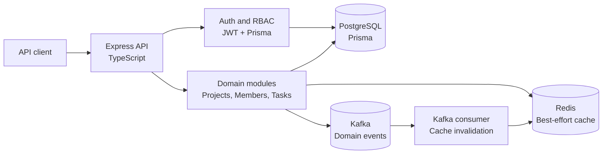

# Architecture Overview

## System Context

The application is a modular Express API. HTTP handlers validate input and delegate to
domain services. Services enforce tenant and authorization rules before using Prisma for
the PostgreSQL source of truth. Redis and Kafka are supporting infrastructure: a failure
in either should not replace or corrupt the synchronous PostgreSQL workflow.

## Module Boundaries

- `src/modules/auth`: registration, login, refresh-token rotation, logout, JWT middleware.
- `src/common/authorization`: role and permission loading plus policy checks.
- `src/common/tenant`: tenant context and tenant-bound resource lookups.
- `src/modules/projects`: project CRUD and archive operations.
- `src/modules/project-members`: membership lifecycle and access checks.
- `src/modules/tasks`: task CRUD, assignment, and archive operations.
- `src/cache`: Redis connection, tenant/user-aware keys, TTL reads, and invalidation.
- `src/events`: typed event contracts, best-effort producer, and cache-invalidation consumer.
- `src/database`: shared Prisma client using the PostgreSQL adapter.

## Authentication Flow

1. Registration verifies that the target tenant is active, hashes the password with bcrypt,
   creates a user, assigns the default member role, stores no password in the response, and
   creates a refresh-token session.
2. Login looks up the user by tenant and email, checks active user and tenant status, and
   compares the submitted password against the stored hash.
3. The access token contains only the user ID (`sub`) and tenant ID, and is signed with
   `JWT_ACCESS_SECRET`.
4. Protected requests validate the bearer token, load the active tenant-bound user, and
   create the request tenant context.
5. Refresh tokens are stored as SHA-256 hashes. Refresh rotates the current token by
   revoking it before creating a replacement session.

Authentication does not create tenants; registration requires an existing active tenant.

## Multi-Tenancy

Tenant identity comes from the verified user record, not from a client-controlled request
parameter. Services pass `tenantId` into reads and writes. Cross-tenant lookups return the
same not-found behavior as missing resources where appropriate.

The database reinforces this boundary:

- Users, projects, roles, tasks, and memberships carry `tenantId` where needed.
- Project members reference `(projectId, tenantId)` and `(userId, tenantId)`.
- Tasks reference `(projectId, tenantId)` and `(assigneeId, tenantId)`.
- Redis keys begin with `tenant:<tenantId>` and include the user ID for user-sensitive views.
- Kafka event metadata includes the tenant ID, and the consumer invalidates only that tenant.

## RBAC

The supported roles are `ADMIN`, `MANAGER`, and `MEMBER`:

| Role      | Effective capabilities                                             |
| --------- | ------------------------------------------------------------------ |
| `ADMIN`   | All defined permissions and tenant-wide project/task access        |
| `MANAGER` | View/manage assigned projects, manage members, create/update tasks |
| `MEMBER`  | View assigned projects, view assigned tasks, update assigned tasks |

Authorization loads role assignments constrained by both user ID and tenant ID. Route
guards check declared roles or permissions, and service policies re-check project membership
for resource-specific access.

## Database Overview

The Prisma schema models:

- `Tenant`: organization identity and lifecycle status.
- `User`: tenant-bound identity, status, and password hash.
- `RefreshToken`: hashed, revocable sessions with expiry.
- `Role`, `Permission`, `UserRole`, `RolePermission`: tenant-scoped RBAC catalog.
- `Project`: tenant-scoped collaboration project with a unique key per tenant.
- `ProjectMember`: project/user membership with tenant-aware composite foreign keys.
- `Task`: tenant-scoped work item with project and optional assignee relations.

Indexes cover the main tenant, status, project, assignee, priority, creation-date, and
refresh-token expiry access paths. Prisma migrations are committed under `prisma/migrations`.

## Redis Usage

Redis is optional and best-effort. The API catches Redis failures and continues against
PostgreSQL. Cached reads include:

- project details and administrator project lists
- task lists and task details
- project member lists and details

Keys are tenant-scoped, user-scoped where visibility differs, and include a short hash of
the normalized query. Writes invalidate the relevant tenant resource prefixes. Membership
changes also invalidate task caches because member visibility affects assigned-task results.
Membership-sensitive project lists are read from PostgreSQL rather than cached to avoid
serving stale authorization results after membership changes.

## Kafka Event Flow

Successful writes publish typed events to `KAFKA_TOPIC`:

- `UserCreated`
- `ProjectCreated`
- `ProjectUpdated`
- `TaskCreated`
- `TaskUpdated`
- `TaskAssigned`

Event payloads contain IDs, tenant metadata, status, and priority where relevant. They do
not contain passwords, password hashes, refresh tokens, or email addresses. The consumer
subscribes with `KAFKA_GROUP_ID` and invalidates tenant caches for project or task events.
That workflow is safe against duplicate delivery because invalidation is idempotent.

Kafka publishing is intentionally separate from the request's database transaction. The
current implementation logs publish failures rather than retrying through an outbox, so
event delivery is not guaranteed when Kafka is unavailable.

## Docker Topology

`docker-compose.yml` starts four services:

- `postgres`: PostgreSQL 16 with a named data volume.
- `redis`: Redis 7 with a ping health check.
- `kafka`: single-node Kafka in KRaft mode with internal and host listeners.
- `app`: the Node.js development container, gated on healthy dependencies.

The app runs `prisma migrate deploy` before `npm run dev`. Host-facing ports are 3000 for
the API, 5432 for PostgreSQL, 6379 for Redis, and 9092 for Kafka.
